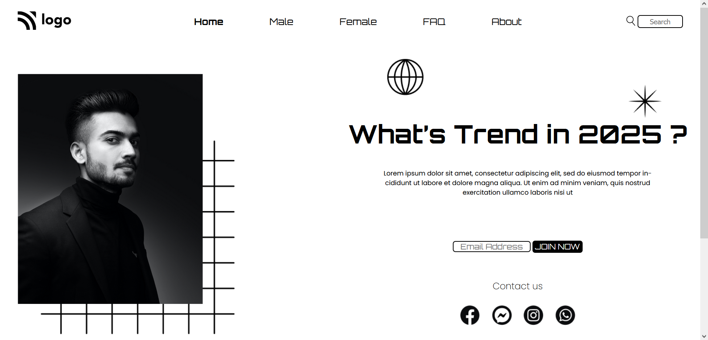

# Project 1 - HTML and CSS

By Ankan

Here's the Website completed

## What I learned from this Project?

- This project was a very good learning experience for me.
- I learned how to use HTML and CSS to create a beutiful website.
- I learned about the ways of positioning elements in the HTML and CSS.

## This project took around 7 hours to complete.
